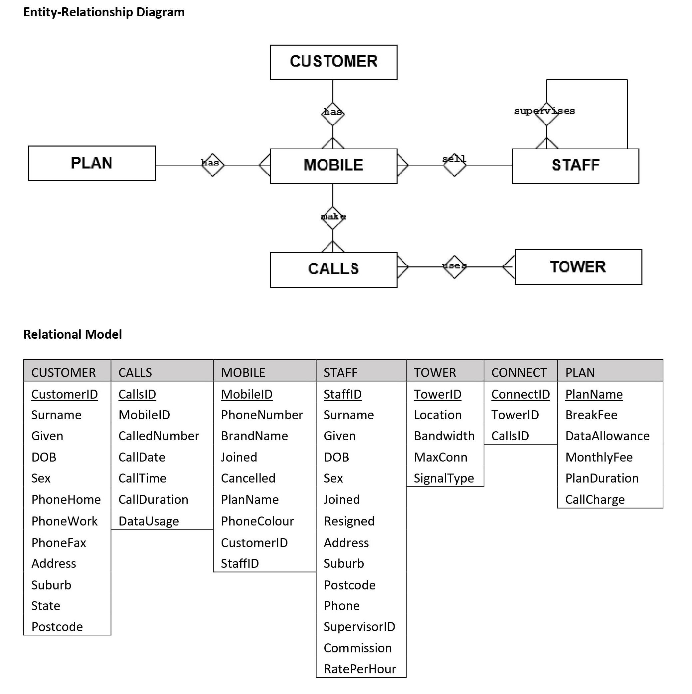

# INSTRUCTIONS
The following case study models a mobile phone company. The company has a number of phones that are sold by staff to various clients. Each phone comes with a plan and each plan has a number of features specific to that plan including:
- a call charge in cents per minute (this does not apply to all plans)
- a plan duration in months
- a break fee if the customer leaves the plan before the end of the plan duration
- a monthly data allowance in gigabytes

Assumptions that are made for the assignment are:
- mobile phones are locked to a plan for the length of the plan duration

## Entity-Relationship Diagram

## Task Summary
In this assessment, you are required to demonstrate your ability to understand the requirements for various data information requests from an existing database and develop appropriate SQL statements to satisfy those requirements.

## Context
Being able to query a database is a fundamental skill that is required by all information systems professionals who work with relational databases. In this assessment, you will utilize the basic query skills that are typically used to extract information for analysis, reporting and data cleansing in a data management setting. Timely provisioning of key business information promotes effective communication and enhanced solution delivery.

## Task Instructions
Examine the relational model and ER diagram and derive the SQL queries to return the required information. Provide SQL statements and the query output for the following:

1. List all the customers who live in any part of CAULFIELD. List only the Customer ID, full name, date of birth and suburb

2. List all of the active staff. Show their Staff ID, full name and weekly salary assuming that they work a 38 hour week

3. Which plan has the most expensive contract to break?

4. Which brands of mobile phone does this company sell? List only the unique brand names

5. Which customer is not able to purchase a phone? Use a query to explain why. 
    - Hint: Review the customer data

6. How many of each phone plan have been sold?

7. What is the average age of an Apple phone user?

8. What are the first and most recent mobile phone purchases?

9. 
    - For calls made in 2018 how many calls were made on the weekend?
    - For calls made in 2018 how many calls were made on each day of the weekend?

10. Provide a listing of the utilization of each tower and its location i.e. how busy each tower is based on the number of connections. Put the busiest tower at the top of the list

11. Did any users on the ‘Large’ plan exceed their monthly allowance during August 2018?

12. The company is upgrading all their 3G towers from to 5G. 
    - How many towers will be upgraded?
    - what SQL will be needed to update the database to reflect the upgrades?

13. 
    - List the full name, join date, resigned date of each staff member and name, join date and resigned date of their manager
    - What do you observe with the data?

14. How much revenue was generated in 2017 by each plan from call charges. Format the output as currency i.e. $123.45

15. List the customers who made phone calls longer than 200 minutes

16. Which customers have more than one mobile phone? List the customer name, suburband state. Order by the customer name

17. Are there any mobile phone plans that are currently unused? This can be obtained a number of ways. Demonstrate this by using the following two query types 
    - Nested subquery

18. List the oldest and the youngest customers in the postcodes 3000 and 3102. Show the customer full name age and suburb details

19. 
    - Create a view that shows the popularity of each phone colour
    - Use this view in a query to determine the least popular phone colour

20. The billing team is getting returned mail because of bad customer addresses. This is causing a loss in revenue.
    - Review the customer data and find at least 3 issues
    - Provide the SQL statements to correct the data problems

